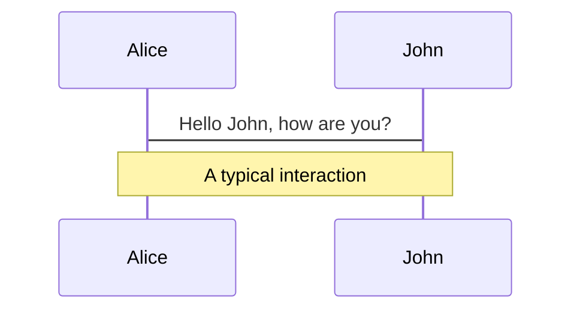
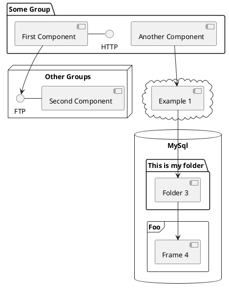

---
# try also 'default' to start simple
theme: default
background: https://images.firstpost.com/wp-content/uploads/2019/08/redbull-rtr-380.jpg?impolicy=website&width=640&height=363
# apply any windi css classes to the current slide
class: 'text-center'
# https://sli.dev/custom/highlighters.html
highlighter: prism
canvasWidth: 800
# show line numbers in code blocks
lineNumbers: true

# persist drawings in exports and build
drawings:
  persist: false
# page transition
transition: fade-out
# use UnoCSS
css: unocss
---

# Fundamental Building Blocks of Kotlin

Bite size kotlin session 2

<div class="pt-12">
    Elena van Engelen - Maslova
</div>

<div class="abs-br m-6 flex gap-2">
  <button @click="$slidev.nav.openInEditor()" title="Open in Editor" class="text-xl slidev-icon-btn opacity-50 !border-none !hover:text-white">
    <carbon:edit />
  </button>
  <a href="https://github.com/elenavanengelenmaslova/kotlin-fundamental-building-blocks" target="_blank" alt="GitHub"
    class="text-xl slidev-icon-btn opacity-50 !border-none !hover:text-white">
    <carbon-logo-github />
  </a>
</div>

<!--
The last comment block of each slide will be treated as slide notes. It will be visible and editable in Presenter Mode along with the slide. [Read more in the docs](https://sli.dev/guide/syntax.html#notes)
-->

---
transition: fade-out
---

# Format

Accelerate your programming skills by mastering the fundamental building blocks of Kotlin while creating an F1 Simulator application! 🏎️️

<v-clicks>

- 📘 **Master the Basics** - Dive into the core elements that make up any Kotlin application.

- 💻 **Code Snippets in Action** - Consolidate your knowledge by trying out interactive code snippets in IntelliJ's scratch file.

- 🏁 **Building in Progress** - As we unpack the basics, you'll be applying what you've learnt by actively building an F1 Simulator app.

- 🎒 **Take-Home Assignments** - Cement your understanding with practical homework designed to reinforce your newly acquired skills.

</v-clicks>

<style>
h1 {
  background-color: #2B90B6;
  background-image: linear-gradient(45deg, #4EC5D4 10%, #146b8c 20%);
  background-size: 100%;
  -webkit-background-clip: text;
  -moz-background-clip: text;
  -webkit-text-fill-color: transparent;
  -moz-text-fill-color: transparent;
}
</style>

<!--
Here is another comment.
-->

---
layout: default
---

# Session overview

<v-clicks>

1. Variables & Constants and Data Types

2. String templates

3. Functions

4. Null safety

5. Control flow statements

6. Exception handling

7. KDoc basics

</v-clicks>

---
transition: fade-out
layout: section

level: 2
---

# Variables

---
transition: fade-out

level: 3
---

# Mutable Variables

<v-clicks>

- Defined using the `var` keyword

- Value can be changed after initial assignment

- Useful when the value needs to be updated based on program logic or user input

- Considerations 
  - Mutable variables should be used judiciously 
  - Excessive use can make code harder to reason about 
  - Best practice: Use `val` when the variable's value does not need to change.

</v-clicks>


---
---

# Mutable variables - RaceCar Example

A public `lapTimes` array is updated using `addLapTime` function after each lap, `currentLap` that holds current lap number and `isPitStopNeeded` and a `currentSpeed` which are updated as needed.

```kotlin {all|4-6,9|4-6,9|9,11-13}
class RaceCar(
  val carNumber: Int,
  val maxSpeed: Double = Random.nextDouble(200.0, 230.0),
  private var currentSpeed: Double = 0.0,
  internal var currentLap: Int = 0,
  internal var isPitStopNeeded: Boolean = false,
  numLaps: Int,
) {
  var lapTimes = arrayOfNulls<Double>(numLaps)
     private set
  
  fun addLapTime(lapNumber: Int, time: Double) {
    lapTimes[lapNumber] = time
  }
}

```

---
---

# Mutable variables - Driver Example

Mutable `points` is updated after each race (if applicable) using `addPoints` function.

```kotlin {all|3|3,6-8}
class Driver(
    val name: String,
    var points: Int = 0,
    val uuid: UUID = UUID.randomUUID() // unique identifier
) {
    fun addPoints(newPoints: Int) {
        points += newPoints
    }
}

```

---
transition: fade-out

level: 3
---

# Immutable Variables

<v-clicks>

- Defined using the `val` keyword

- Value cannot be changed after initial assignment - it is read-only

- Useful when the value does not change after initial assignment

- Enhances code readability and safety

</v-clicks>

---
---

# Immutable Variables - Driver Example

The properties `name` and `uuid` and `isPitStopNeeded` do not change after Driver instance is created.

```kotlin {all|2,4}
class Driver(
    val name: String,
    var points: Int = 0,
    val uuid: UUID = UUID.randomUUID() // unique identifier
) {
    fun addPoints(newPoints: Int) {
        points += newPoints
    }
}

```

---
transition: fade-out

level: 3
---

# Variable Scope and Lifetime
Variable 'scope' and 'lifetime' are essential aspects to understand for efficient variable management.

<v-clicks>


- Scope defines the code region where a variable is accessible.

- Local Variables

- Member Variables

- Top-level Variables

- Lifetime of a variable extends from its declaration point until its scope's termination.

</v-clicks>

<!--
- Local Variables: Declared inside a block of code (like a function). Accessible only within the block they were declared. Lifetime extends until the end of the block.
- Member Variables: Declared inside a class (but not inside a method). By default, they are public and can be accessed where the class object is accessible. Lifetime extends for the duration of the object of the class.
- Top-level Variables: Declared outside any class or function. By default, they are public and can be accessed from any part of your program.

-->

---
---

# Variable Scope Example
Can you identify local, member, and top level variables?

```kotlin {all|9,13|9,11|13-15|5-8,11|1}
var currentWeather: String = "Sunny"

class RaceCar(
    val carNumber: Int,
    val maxSpeed: Double = Random.nextDouble(200.0, 230.0),
    private var currentSpeed: Double = 0.0,
    internal var currentLap: Int = 0,
    internal var isPitStopNeeded: Boolean = false,
    numLaps: Int,
) {
    var lapTimes = arrayOfNulls<Double>(numLaps)

    fun addLapTime(lapNumber: Int, time: Double) {
        lapTimes[lapNumber] = time
    }
}
```

<!--

- Properties  `numLaps`, `lapNumber` and `time` are **local variables**
- Properties `carNumber`, `maxSpeed`, `currentSpeed`, `currentLap`, `isPitStopNeeded` and `lapTimes` are **member variables**. The property 
- `currentWeather` is a **top level variable**. 

-->

---
transition: fade-out
layout: section

level: 2
---

# Constants

---
transition: fade-out

level: 3
---
# Understanding and Declaring Constants

Constants are immutable values, determined at compile-time, that remain unchanged throughout program execution.

<v-clicks>

- Constants can be declared as top-level or within a companion object utilizing the `const` keyword with `val`
  
- Constants are public by default and their types can be inferred by the Kotlin compiler

- Constants serve various purposes such as:
  - Providing stable configuration settings
  - Representing mathematical constants
  - Denoting unchanging parameters in an application, like F1 Race rules


</v-clicks>

---
transition: fade-out

level: 3
---
# Restrictions and Benefits of Constants

<v-clicks>

- Constants are limited to primitive types and Strings in Kotlin.

- Non-changing, complex objects that are not of primitive types or Strings can be declared as read-only properties using val.

- Constants improve application performance due to compile-time optimization.

- Code maintenance becomes easier as constants help avoid hard-coded values and reduce potential errors.

- Constants can be used alongside other constants in expressions, computed at compile time.

</v-clicks>


---
---

# Constants Example
Can you think of any Formula one rules that could be a constant?

```kotlin {all|1,2,10-12}
const val MAX_TEAMS = 10
const val MAX_LAPS = 5

class Race(
    val numberOfLaps: Int,
    val teams: List<Team>,
    var currentLap: Int = 0,
) {
    // ...
    companion object {
        const val PITSTOP_TIME = 5.0 // 5 minutes
    }
}
```

<!--

- Constants  `MAX_TEAMS`, `MAX_LAPS` are top-level constants
- Constant `PITSTOP_TIME` is a class level constant defined within a companion object

-->


---
preload: false
---

# Start developing F1 simulator app

Stirling Moss: "To achieve anything in this game, you must be prepared to dabble in the boundary of disaster.”

<div class="w-full relative mt-6">
  <div class="relative w-80 h-80">
    
  </div>

  <div
    class="text-5xl absolute bottom-16 left-40 text-[#2B90B6] z-10"
    v-motion
    :initial="{ x: -80, opacity: 0}"
    :enter="{ x: -7, opacity: 1, transition: { delay: 2000, duration: 1000 } }">
    Drive with 
  </div>

  <div
    class="text-5xl absolute bottom-16 left-[calc(50%+3.8rem)] text-[#2B90B6] z-10"
    v-motion
    :initial="{ y: 100, opacity: 0}"
    :enter="{ y: -4, opacity: 1, transition: { delay: 3500, duration: 1000 } }"
    id="replaceK">
    Kotlin!
  </div>


</div>

<script setup lang="ts">
const final = {
  x: 0,
  y: 0,
  rotate: 0,
  scale: 1,
  transition: {
    type: 'spring',
    damping: 10,
    stiffness: 20,
    mass: 2
  }
}

setTimeout(() => {
  document.getElementById('replaceK').style.opacity = "0";
}, 3500);
</script>


---


# Diagrams

You can create diagrams / graphs from textual descriptions, directly in your Markdown.

<div class="grid grid-cols-3 gap-10 pt-4 -mb-6">





</div>

[Learn More](https://sli.dev/guide/syntax.html#diagrams)

---
src: ./pages/multiple-entries.md
hide: false
---

---
layout: center
class: text-center
---

# Learn More

[Documentations](https://sli.dev) · [GitHub](https://github.com/slidevjs/slidev) · [Showcases](https://sli.dev/showcases.html)

---
layout: end
---

