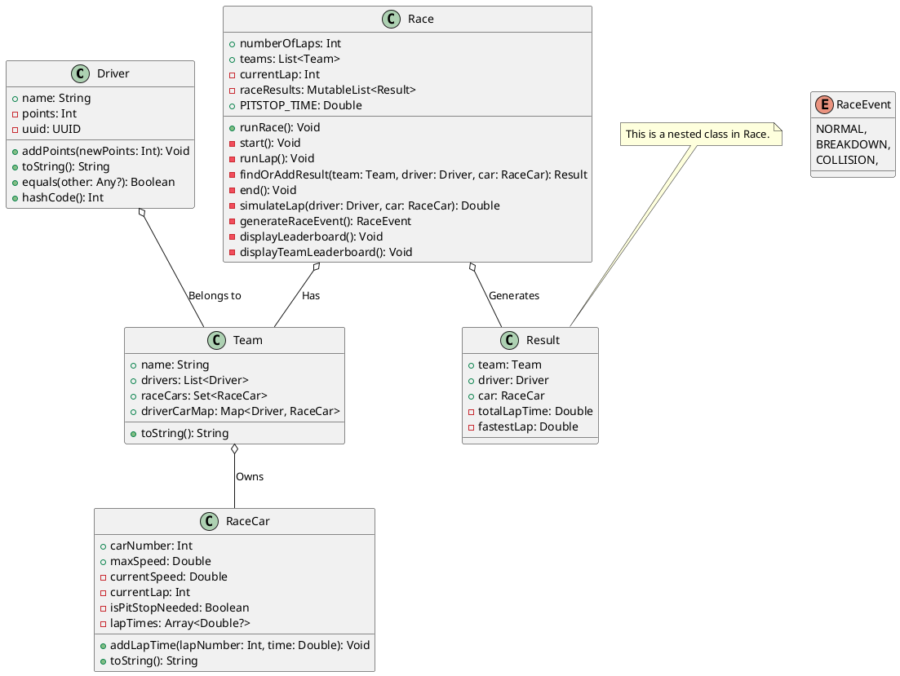

---
# try also 'default' to start simple
theme: default
background: https://images.firstpost.com/wp-content/uploads/2019/08/redbull-rtr-380.jpg?impolicy=website&width=640&height=363
# apply any windi css classes to the current slide
class: 'text-center'
# https://sli.dev/custom/highlighters.html
highlighter: prism
canvasWidth: 800
# show line numbers in code blocks
lineNumbers: true

# persist drawings in exports and build
drawings:
  persist: false
# page transition
transition: fade-out
# use UnoCSS
css: unocss
---

# Fundamental Building Blocks of Kotlin, Part 1

Bite size kotlin session 2

<div class="pt-12">
    Elena van Engelen - Maslova
</div>

<div class="abs-br m-6 flex gap-2">
  <button @click="$slidev.nav.openInEditor()" title="Open in Editor" class="text-xl slidev-icon-btn opacity-50 !border-none !hover:text-white">
    <carbon:edit />
  </button>
  <a href="https://github.com/elenavanengelenmaslova/kotlin-fundamental-building-blocks" target="_blank" alt="GitHub"
    class="text-xl slidev-icon-btn opacity-50 !border-none !hover:text-white">
    <carbon-logo-github />
  </a>
</div>

<!--
The last comment block of each slide will be treated as slide notes. It will be visible and editable in Presenter Mode along with the slide. [Read more in the docs](https://sli.dev/guide/syntax.html#notes)
-->

---
transition: fade-out
---

# Format

Accelerate your programming skills by mastering the fundamental building blocks of Kotlin while creating an F1 Simulator application! 🏎️️

<v-clicks>

- 📘 **Master the Basics** - Dive into the core elements that make up any Kotlin application.

- 💻 **Code Snippets in Action** - Consolidate your knowledge by trying out interactive code snippets in IntelliJ's scratch file.

- 🏁 **Building in Progress** - As we unpack the basics, you'll be applying what you've learnt by actively building an F1 Simulator app.

- 🎒 **Take-Home Assignments** - Cement your understanding with practical homework designed to reinforce your newly acquired skills.

</v-clicks>

<style>
h1 {
  background-color: #2B90B6;
  background-image: linear-gradient(45deg, #4EC5D4 10%, #146b8c 20%);
  background-size: 100%;
  -webkit-background-clip: text;
  -moz-background-clip: text;
  -webkit-text-fill-color: transparent;
  -moz-text-fill-color: transparent;
}
</style>

<!--
Here is another comment.
-->

---
layout: default
---

# Session overview

<v-clicks>

1. Variables

2. Constants 

3. Data Types

4. String templates

5. Functions

</v-clicks>

---
transition: fade-out
layout: section

level: 2
---

# Variables

---
transition: fade-out

level: 3
---

# Mutable Variables

<v-clicks>

- Defined using the `var` keyword

- Value can be changed after initial assignment

- Useful when the value needs to be updated based on program logic or user input

- Considerations 
  - Mutable variables should be used judiciously 
  - Excessive use can make code harder to reason about 
  - Best practice: Use `val` when the variable's value does not need to change.

</v-clicks>


---
---

# Mutable variables - RaceCar Example

```kotlin {all|4-6,9|9,11-13}
class RaceCar(
  val carNumber: Int,
  val maxSpeed: Double = Random.nextDouble(200.0, 230.0),
  private var currentSpeed: Double = 0.0,
  internal var currentLap: Int = 0,
  internal var isPitStopNeeded: Boolean = false,
  numLaps: Int,
) {
  var lapTimes = arrayOfNulls<Double>(numLaps)
     private set
  
  fun addLapTime(lapNumber: Int, time: Double) {
    lapTimes[lapNumber] = time
  }
}

```

<!--
A public `lapTimes` array is updated using `addLapTime` function after each lap, `currentLap` that holds current lap number and `isPitStopNeeded` and a `currentSpeed` which are updated as needed.

-->
---
---

# Mutable variables - Driver Example

Mutable `points` is updated after each race (if applicable) using `addPoints` function.

```kotlin {all|3|3,6-8}
class Driver(
    val name: String,
    var points: Int = 0,
    val uuid: UUID = UUID.randomUUID() // unique identifier
) {
    fun addPoints(newPoints: Int) {
        points += newPoints
    }
}

```

---
transition: fade-out

level: 3
---

# Immutable Variables

<v-clicks>

- Defined using the `val` keyword

- Value cannot be changed after initial assignment - it is read-only

- Useful when the value does not change after initial assignment

- Enhances code readability and safety

</v-clicks>

---
---

# Immutable Variables - Driver Example

The properties `name` and `uuid` and `isPitStopNeeded` do not change after Driver instance is created.

```kotlin {all|2,4}
class Driver(
    val name: String,
    var points: Int = 0,
    val uuid: UUID = UUID.randomUUID() // unique identifier
) {
    fun addPoints(newPoints: Int) {
        points += newPoints
    }
}

```

---
transition: fade-out

level: 3
---

# Variable Scope and Lifetime
Variable 'scope' and 'lifetime' are essential aspects to understand for efficient variable management.

<v-clicks>


- Scope defines the code region where a variable is accessible.

- Local Variables

- Member Variables

- Top-level Variables

- Lifetime of a variable extends from its declaration point until its scope's termination.

</v-clicks>

<!--
- Local Variables: Declared inside a block of code (like a function). Accessible only within the block they were declared. Lifetime extends until the end of the block.
- Member Variables: Declared inside a class (but not inside a method). By default, they are public and can be accessed where the class object is accessible. Lifetime extends for the duration of the object of the class.
- Top-level Variables: Declared outside any class or function. By default, they are public and can be accessed from any part of your program.

-->

---
---

# Variable Scope Example
Can you identify local, member, and top level variables?

```kotlin {all|9,13|9,11|13-15|5-8,11|1}
var currentWeather: String = "Sunny"

class RaceCar(
    val carNumber: Int,
    val maxSpeed: Double = Random.nextDouble(200.0, 230.0),
    private var currentSpeed: Double = 0.0,
    internal var currentLap: Int = 0,
    internal var isPitStopNeeded: Boolean = false,
    numLaps: Int,
) {
    var lapTimes = arrayOfNulls<Double>(numLaps)

    fun addLapTime(lapNumber: Int, time: Double) {
        lapTimes[lapNumber] = time
    }
}
```

<!--

- Properties  `numLaps`, `lapNumber` and `time` are **local variables**
- Properties `carNumber`, `maxSpeed`, `currentSpeed`, `currentLap`, `isPitStopNeeded` and `lapTimes` are **member variables**. The property 
- `currentWeather` is a **top level variable**. 

-->

---
preload: false
---

# Start developing F1 simulator app

Stirling Moss: "To achieve anything in this game, you must be prepared to dabble in the boundary of disaster.”

<div class="w-full relative mt-6">
  <div class="relative w-80 h-80">
    
  </div>

  <div
    class="text-5xl absolute bottom-16 left-40 text-[#2B90B6] z-10"
    v-motion
    :initial="{ x: -80, opacity: 0}"
    :enter="{ x: -7, opacity: 1, transition: { delay: 2000, duration: 1000 } }">
    Drive with 
  </div>

  <div
    class="text-5xl absolute bottom-16 left-[calc(50%+3.8rem)] text-[#2B90B6] z-10"
    v-motion
    :initial="{ y: 100, opacity: 0}"
    :enter="{ y: -4, opacity: 1, transition: { delay: 3500, duration: 1000 } }"
    id="replaceK">
    Kotlin!
  </div>


</div>

<script setup lang="ts">
const final = {
  x: 0,
  y: 0,
  rotate: 0,
  scale: 1,
  transition: {
    type: 'spring',
    damping: 10,
    stiffness: 20,
    mass: 2
  }
}

setTimeout(() => {
  document.getElementById('replaceK').style.opacity = "0";
}, 3500);
</script>


---
transition: fade-out
layout: section

level: 2
---

# Constants

---
transition: fade-out

level: 3
---
# Understanding and Declaring Constants

Constants are immutable values, determined at compile-time, that remain unchanged throughout program execution.

<v-clicks>

- Constants can be declared as top-level or within a companion object utilizing the `const` keyword with `val`
  
- Constants are public by default and their types can be inferred by the Kotlin compiler

- Constants serve various purposes such as:
  - Providing stable configuration settings
  - Representing mathematical constants
  - Denoting unchanging parameters in an application, like F1 Race rules


</v-clicks>

---
transition: fade-out

level: 3
---
# Restrictions and Benefits of Constants

<v-clicks>

- Constants are limited to primitive types and Strings in Kotlin.

- Non-changing, complex objects that are not of primitive types or Strings can be declared as read-only properties using val.

- Constants improve application performance due to compile-time optimization.

- Code maintenance becomes easier as constants help avoid hard-coded values and reduce potential errors.

- Constants can be used alongside other constants in expressions, computed at compile time.

</v-clicks>


---
---

# Constants Example
Can you think of any Formula one rules that could be a constant?

```kotlin {all|1,2,10-12}
const val MAX_TEAMS = 10
const val MAX_LAPS = 5

class Race(
    val numberOfLaps: Int,
    val teams: List<Team>,
    var currentLap: Int = 0,
) {
    // ...
    companion object {
        const val PITSTOP_TIME = 5.0 // 5 minutes
    }
}
```

<!--

- Constants  `MAX_TEAMS`, `MAX_LAPS` are top-level constants
- Constant `PITSTOP_TIME` is a class level constant defined within a companion object

-->

---
transition: fade-out
layout: section

level: 2
---

# Data Types

---
transition: fade-out

level: 3
---
# Basic Data Types

<v-clicks>

- Int and Long
  - Integer data types used to represent numbers without a decimal point. 
  - Used in the F1 app for tracking points, car numbers, and laps.

- Double and Float
  - Used to represent numbers with a decimal point. 
  - In the F1 app, these types are utilized for tracking speed and time.

- Boolean
  - Can hold two values: true or false. 
  - It is used in the F1 app to signal if a pit stop is needed.

</v-clicks>

---
transition: fade-out

level: 3
---
# Basic Data Types, continued ...

<v-clicks>

- Char and String
  - Char represents a single character, while a String is a sequence of characters.
  - Used in the F1 app to represent names of drivers and teams.

- Array
  - A container that can hold a fixed number of elements of a single type.
  - In the F1 app, arrays are used to store lap times.

</v-clicks>

---
---

# Basic Data Types Example
In the `RaceCar` class, `Int`, `Double`, `Boolean` data types and an `Array` of `Double` are used to represent car number, maximum speed, current speed, current lap, pit stop necessity, and lap times respectively.

```kotlin {all|2,5,7|3,4|6|9}
class RaceCar(
    val carNumber: Int,
    val maxSpeed: Double = Random.nextDouble(200.0, 230.0),
    private var currentSpeed: Double = 0.0,
    internal var currentLap: Int = 0,
    internal var isPitStopNeeded: Boolean = false,
    numLaps: Int,
) {
    var lapTimes = arrayOfNulls<Double>(numLaps)
        private set
// ...        
}
```

<!--

- Integer carNumber to identify a car within a team, currentLap to keep track of current lam nuber, numLaps is an integer representing total number of laps to be raced,
- maxSpeed is the maximum speed of the car, randomly generated when not provided in the constructor, currentSpeed is to show the current speed of the car
- isPitStopNeeded is a boolean indicated whether car needs a pit stop
- lapTimes is an array of nullable Double used to record time taken to complete each lap for this car

-->


---
transition: fade-out

level: 3
---
# Basic Operations

<v-clicks>

- Arithmetic Operators (`+`, `-`, `*`, `/`, `%`)
  - Used for basic mathematical operations. 
  - In the F1 app, `points = points + newPoints` could be used to add up `Driver` points.
  
- Comparison Operators (`==,` `!=`, `<`, `>`, `<=`, `>=`)
  - Used to compare two values. 
  - In the Race class, the `<` operator compares the current lap time with the fastest lap time to track the fastest lap during a race.

</v-clicks>


---
transition: fade-out

level: 3
---
# Basic Operations, continued ...

<v-clicks>

- Assignment Operators (`=`, `+=`, `-=`, `*=`, `/=`, `%=`, `++`, `--`)
  - Used to assign values to variables. 
  - `points += newPoints` in the Driver class uses the `+=` operator to add points to the existing total.
  
  - Logical Operators (`&&`, `||`, `!`)
    - Used to perform logical AND, OR and NOT operations.

</v-clicks>

---
---

# Basic Operations Example

```kotlin {all|7-9}
class Driver(
    val name: String,
    var points: Int = 0,
    val uuid: UUID = UUID.randomUUID() // unique identifier
) {

    fun addPoints(newPoints: Int) {
        points += newPoints
    }
// ...        
}
```

<!--

-->

---
transition: fade-out

level: 3
---
# Collections

<v-clicks>

- Collections in Kotlin - Lists, Sets, and Maps - manage and organize data efficiently.

- `List`: An ordered collection of elements, allows duplicates

- `Set`: An unordered collection of unique elements

- `Map`: A collection of key-value pairs

- Collections provide a variety of methods for handling and processing elements

- Collections in Kotlin are immutable by default - their contents can't be modified once they're created

- Mutable collections - `MutableList`, `MutableSet`, and `MutableMap` - allow modification of contents

</v-clicks>

---
---

# Collections Example
Immutable List, Set and Map 
```kotlin {all|3|4|6}
class Team(
    val name: String,
    val drivers: List<Driver>,
    val raceCars: Set<RaceCar>,
) {
    val driverCarMap: Map<Driver, RaceCar> = drivers.zip(raceCars).toMap()
}
```

<!--

-->

---
---

# Collections Example - mutable list and methods examples
Mutable list of results & examples of methods for handling and processing elements
```kotlin {all|2|4-14}
class Race(val numberOfLaps: Int, val teams: List<Team>, var currentLap: Int = 0) {
    private val raceResults: MutableList<Result> = mutableListOf()
    // ...
    private fun runLap() {
        teams.forEach { team ->
            team.driverCarMap.forEach { (driver, car) ->
                val result = findOrAddResult(team, driver, car)
                // simulate lap and update result
            }
        }
    }
}
```

<!--

-->


---
---

# Collections Example - methods examples
Mutable list of results & examples of methods for handling and processing elements

```kotlin {all|2-10|2,13|2,13,14}
class Race(val numberOfLaps: Int, val teams: List<Team>, var currentLap: Int = 0) {
    private val raceResults: MutableList<Result> = mutableListOf()
    
    data class Result(
        val team: Team,
        val driver: Driver,
        val car: RaceCar,
        var totalLapTime: Double = 0.0,
        var fastestLap: Double = Double.MAX_VALUE,
    )
    // ...
    private fun findOrAddResult(team: Team, driver: Driver, car: RaceCar) =
        raceResults.find { it.driver == driver }
            ?: Result(team, driver, car).also { raceResults.add(it) }
}
```
---
transition: fade-out

level: 3
---
# Custom Data Types - Classes

<v-clicks>

- Blueprints for creating objects
  
- Encapsulate related properties and methods
  
- Allow the definition of custom types

- Fundamental instance methods 
  - `equals()`: Compares instance with the specified object for equality 
  - `hashCode()`: Returns a hash code value for the object 
  - `toString()`: Returns a string representation of the object

</v-clicks>

---
---

# Class Example
Driver class overrides `equals`, `hashCode` and `toString`
```kotlin {all|3-5|6-12|13-15}
class Driver(val name: String, var points: Int = 0, val uuid: UUID = UUID.randomUUID(),) {
   // ...
    override fun toString(): String {
        return "Driver(name='$name', points=$points)"
    }
    override fun equals(other: Any?): Boolean {
        if (this === other) return true
        if (javaClass != other?.javaClass) return false
        other as Driver
        if (uuid != other.uuid) return false
        return true
    }
    override fun hashCode(): Int {
        return uuid.hashCode()
    }
}

```

<!--
We can generate these with IntelliJ
-->

---
transition: fade-out

level: 3
---
# Custom Data Types - Data Classes

<v-clicks>

- Designed primarily to hold data.
  
- Auto-generated methods:  several useful generate methods, including 
  - `equals()`: Compares instance with the specified object for equality
  - `hashCode()`: Returns a hash code value for the object
  - `toString()`: Returns a string representation of the object
  - `copy()`: Used to duplicate objects with some modifications

</v-clicks>

---
---

# Data Classes Example
Inner class of Race, holds race results for a driver.
```kotlin {all}
data class Result(
    val team: Team,
    val driver: Driver,
    val car: RaceCar,
    var totalLapTime: Double = 0.0,
    var fastestLap: Double = Double.MAX_VALUE,
)

```
Auto generates methods including `equals`, `hashCode`, `toString` and `copy`.
<!--
-->

---
transition: fade-out

level: 3
---
# Custom Data Types - Enum Classes

<v-clicks>

- Designed primarily to hold data.

- Auto-generated methods:  several useful generate methods, including
  - `equals()`: Compares instance with the specified object for equality
  - `hashCode()`: Returns a hash code value for the object
  - `toString()`: Returns a string representation of the object
  - `copy()`: Used to duplicate objects with some modifications

</v-clicks>

---
---

# Enum Example
The RaceEvent enum denotes different types of events that can occur during a race. It clearly encapsulates these related constants, improving code readability and maintainability.

```kotlin {all}
enum class RaceEvent {
    NORMAL,
    BREAKDOWN,
    COLLISION,
}

```

<!--

-->

---

# Class Diagram



---
transition: fade-out
layout: section

level: 2
---

# String templates

---
transition: fade-out

level: 3
---
# What is a String?

<v-clicks>

- Strings in Kotlin are objects of the `String` class

- Strings are immutable

- Strings are considered sequences of characters
  
- Strings are defined by using double quotes ("...")
  
- String class provides several methods to manipulate and examine the content
  
- Strings can be compared using standard comparison operators and functions

</v-clicks>

---
transition: fade-out

level: 3
---
# String Templates

<v-clicks>

- String concatenation is traditional but can be cumbersome and less efficient

- String templates in Kotlin improve readability and efficiency.

- String Interpolation: enables embedding of expressions within string templates

- Raw Strings and String Templates
  - Raw strings allow strings to be included exactly as they're written
  - Raw strings and string templates can be used together to improve readability


</v-clicks>
---
---

# String Templates Example

```kotlin {all|4,10}
    private fun start() {
        for (lap in 1..numberOfLaps) {
            currentLap = lap
            println("Starting lap $currentLap")
            runLap()
        }
    }
 
    private fun TeamResult.format(index: Int): String {
        return "${index + 1}. Team ${this.team.name}"
    }

```

---
---

# Raw Strings & String Templates Example

```kotlin {all|5-9}
     private fun displayLeaderboard() {
        println("\n--- LEADERBOARD ---")
        raceResults.sortBy { it.totalLapTime }
        raceResults.forEachIndexed { index, result ->
            val leaderboardEntry = """
            |${index + 1}. Driver ${result.driver.name} in car #${result.car.carNumber}
            |from team ${result.team.name} with total time ${result.totalLapTime} min.
            |(fastest lap: ${result.fastestLap} min.)
            """.trimMargin()
            println(leaderboardEntry)
        }
    }
```

<!--

-->

---
layout: end
---

